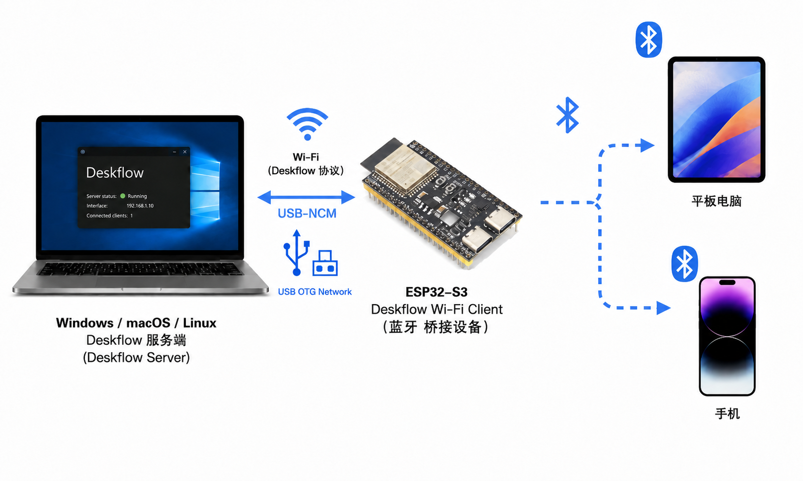
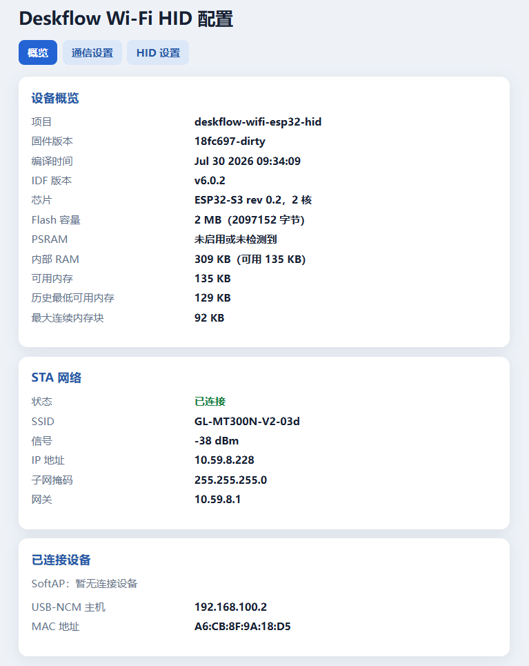
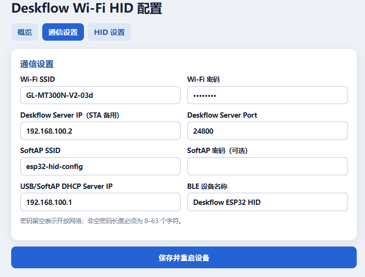
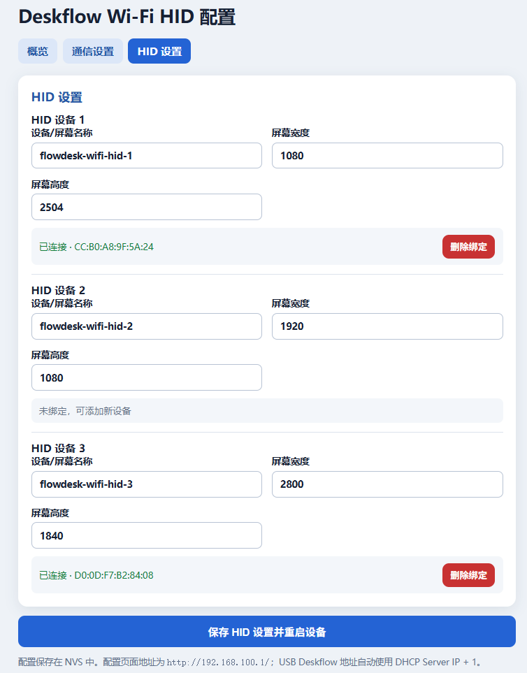

# Deskflow ESP32-S3 USB/Wi-Fi Client → NimBLE HID

[Deskflow](https://github.com/deskflow/deskflow) 在 windows/mac/linux 的计算机之间表现出色，但由于iOS 和 Android 出于安全原因，不允许后台应用拦截或模拟系统级的 HID（人机接口设备）事件的限制，无法支持 iPadOS / Android / HomonyOS 等移动平台。Deskflow-Wifi-ESP32-HID 通过将 ESP32-S3 模拟为**多个**Deskflow客户端 + HID 键盘鼠标的方式将 Deskflow 的能力扩展到这些设备。

ESP32-S3 优先通过 USB CDC-NCM、备用通过 Wi-Fi STA 与 Deskflow 服务机建立连接，模拟为**多个**Deskflow 客户端和 HID 设备。SoftAP 保留用于配置和备用接入。当平板/手机/电脑添加蓝牙 HID 设备时，Deskflow 主机添加设备。每个屏幕的键盘/鼠标事件都会被转发到配对的电脑、平板或手机。

本项目不需要对 [Deskflow](https://github.com/deskflow/deskflow) 做任何修改。

## 适用场景

<div align="center">
  
</div>

## 已知问题

- Wi-Fi 与 BLE 共用 2.4 GHz 射频时可能产生延迟，低延迟场景建议使用 USB-NCM。
- 不支持 deskflow 的剪贴板功能。
- 由于鼠标方式出入屏幕的位置与标准的差异，可能出现鼠标在屏幕内边界上，无法向一个方向移动，这是只需要将鼠标向相反方向移动距离大一点，再返回，一般可以解决。
- 目前只支持3个设备，表现良好。用户可以自行尝试更多设备。

## 一些技巧

- 连接手机或平板，屏幕宽度和屏幕高度都，设置为最长边，可以在屏幕旋转中的体验更好。例如, 2504x1080的手机，可以设置屏幕宽度和屏幕高度都是 2504。
- ... 

## 开发板

[YD-ESP32-23](https://github.com/rtek1000/YD-ESP32-23)

## 默认配置

在 [app_config.h](main/app_config.h) 中配置。

- Wi-Fi SSID：`GL-MT300N-V2-03d`
- Wi-Fi 密码：`goodlife`
- Deskflow 服务器：`192.168.41.83:24800`
- 配置 SoftAP：`esp32-hid-config`（无密码）
- USB/SoftAP DHCP Server：`192.168.100.1`
- USB Deskflow 服务端：`192.168.100.2`（DHCP Server 地址 + 1）
- Deskflow 客户端屏幕：`esp32-hid-1`、`esp32-hid-2`、`esp32-hid-3`
- 虚拟屏幕尺寸：`1920x1080`
- 蓝牙名称：`Deskflow ESP32 HID`
- 最大同时 HID 主机数：`3`
- 板载 RGB 灯：GPIO48；光标进入设备 1/2/3 时显示红/绿/蓝，离开时熄灭

可在 `main/app_config.h` 中修改这些值。

## Wi-Fi 配置门户

ESP32 启动后，会运行一个 SoftAP。默认 SoftAP 的 SSID 为：

```text
esp32-hid-config
```

连接该网络并打开配置页面：

```text
http://192.168.100.1/
```
<div align="center">
  
  
  
</div>

页面包含通信设置（Wi-Fi 凭据、STA 备用 Deskflow 服务器的 IPv4 地址和端口、SoftAP 凭据、USB/SoftAP DHCP Server 地址以及 BLE 设备名称），以及每个 HID 槽位单独的 Deskflow 屏幕名称、宽度和高度。点击 **保存并重启设备** 来验证并将表单持久化到 NVS 中。已保存的值将覆盖 `main/app_config.h` 中的编译时默认值。

SoftAP 密码是可选的。如果非空，必须包含 8-63 个字符；留空则会创建一个开放的配置网络。

## USB 与 Wi-Fi 链路

ESP32-S3 的原生 USB-OTG 接口会枚举为 CDC-NCM 网卡。USB-NCM 与
SoftAP 位于同一个 `255.255.255.0` 二层桥中，桥地址即配置页面中的
DHCP Server 地址。租约从该地址的下一个地址开始；使用默认配置时，
USB 电脑获得 `192.168.100.2`，随后连接 SoftAP 的终端依次获得后续地址。

Deskflow 客户端优先连接 DHCP Server 地址 + 1 的 USB 电脑。USB 断开或
该地址不可连接时，改用配置页面中的 Deskflow Server IP，通过 Wi-Fi STA
重试。为了保证 USB 电脑取得第一个租约，请在 ESP32-S3 启动或复位前连接
USB；USB-NCM 会先于 SoftAP 初始化。

ESP32-S3 原生 USB 使用 GPIO19（D-）和 GPIO20（D+）。UART0 继续作为主要
日志控制台，因为原生 USB-OTG 外设已用于 NCM。

## 构建与烧录

需要 ESP-IDF 6.x：

```sh
idf.py set-target esp32s3
idf.py build
idf.py -p PORT flash monitor
```

项目使用 ESP-IDF 的 1.5 MiB 单工厂应用分区表。未启用 OTA 槽位；NVS 仍可用于 Wi-Fi 参数、BLE 绑定和 HID 目标映射。

在 `main/app_config.h` 中设置编译时默认值，或在配置页面上修改。将配置好的 HID 屏幕名称添加到 Deskflow Server 布局中，然后在每个目标设备的蓝牙设置中配对配置好的 BLE 设备名称。第一个配对的主机关联 HID 槽位 1，第二个关联槽位 2，第三个关联槽位 3：

```text
esp32-hid-1 -> 第一个 BLE 主机
esp32-hid-2 -> 第二个 BLE 主机
esp32-hid-3 -> 第三个 BLE 主机
```

屏幕与对端地址的映射以及 BLE 绑定密钥均持久化存储在 NVS 中。ESP32 会持续进行快速可连接广播，直到所有三个槽位均已连接，并在任意目标断开时恢复广播。手机或平板必须保持蓝牙开启，并将该设备保留在已配对设备列表中。

当所有 HID 目标均离线时，启动时不会创建任何 Deskflow 会话。连接目标 1 仅会创建 `esp32-hid-1`；随后连接目标 2 才会创建 `esp32-hid-2`。当某个 HID 目标断开连接时，其 Deskflow TCP 会话大约在一秒内关闭，并在该目标重新连接时以相同的编号名称重新创建。

## 已实现的协议子集

该桥接器支持长度前缀的 Deskflow/Synergy 协议帧，能够处理键盘按下/释放/重复、绝对和相对指针移动、鼠标按键、垂直滚轮、屏幕进入/离开、屏幕信息查询、心跳保活，以及 Deskflow Server 选择的 `Barrier` 或 `Synergy` 握手前缀。同时支持协议 1.8 的语言感知键盘按下（`DKDL`）帧。每处理完一条服务器消息，客户端会以启用 `TCP_NODELAY` 的方式发送 `CNOP` 回复，以避免 TCP 延迟确认带来的交互延迟。

剪贴板、拖放、水平滚动、死键、Unicode 文本输入以及消费者/媒体按键目前不会转发。键盘映射覆盖 ASCII 字母/数字、常用控制键、导航键和修饰键掩码。

## 致谢

项目灵感来源于: [DShare-HID](https://github.com/lockekk/dshare-hid)
